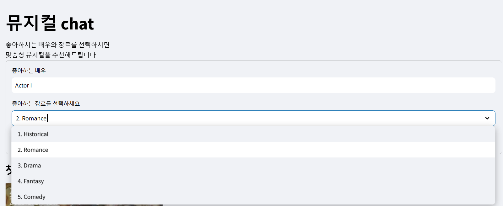
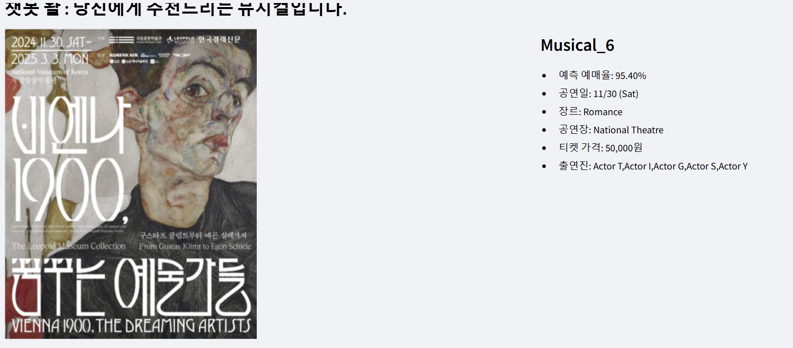
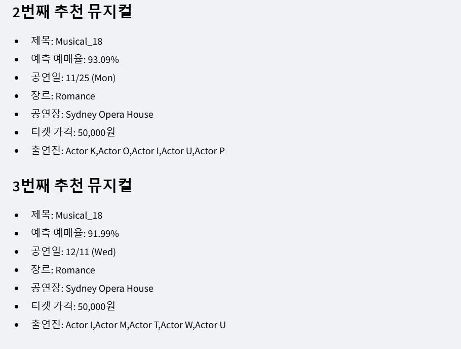
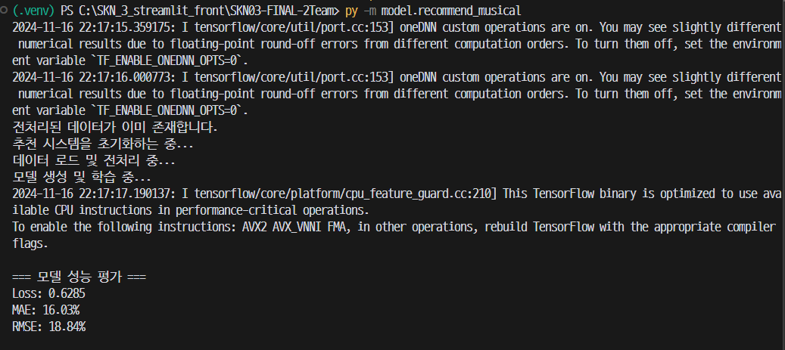
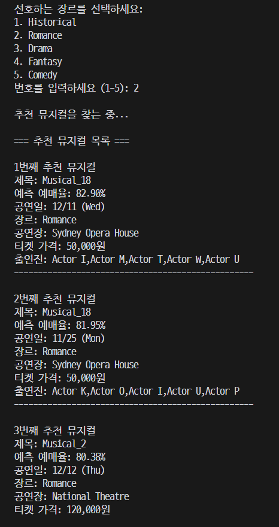

# SKN03-FINAL-2Team
SKN03-FINAL-2Team


# DeepFM 모델을 이용한 아이템-아이템 추천 시스템

이 프로젝트는 **DeepFM** 모델을 사용하여 아이템-아이템 추천 시스템을 구축하는 방법을 설명합니다. 주로 **아이템** 간의 상호작용을 모델링하고, **Deep Neural Networks (DNN)**와 **Factorization Machines (FM)**을 결합하여 추천 결과를 도출합니다.

## 1. 입력 데이터

각 **아이템(뮤지컬)**을 \( i \)로 표현하고, 각 **아이템의 특성**(예: 장르, 배우, 감독 등)은 피쳐로 벡터화하여 모델에 입력합니다.
```markdown
- **장르 특성 벡터**: \( \mathbf{x}_i^{\text{genre}} \)
- **배우 특성 벡터**: \( \mathbf{x}_i^{\text{actor}} \)
- **감독 특성 벡터**: \( \mathbf{x}_i^{\text{director}} \)
```

각 특성에 대해 하나의 벡터가 주어지며, 이 벡터들을 결합하여 아이템 \( i \)의 최종 특성 벡터를 얻을 수 있습니다.

## 2. Factorization Machine (FM)에서의 상호작용 모델링

FM은 **이차 상호작용**(second-order interactions)을 모델링하는데, 각 아이템의 특성 간 상호작용을 내적(inner product)을 통해 계산합니다.

아이템 \( i \)와 \( j \)에 대해 FM은 다음과 같이 **이차 상호작용**을 모델링합니다:

```markdown
\[
\hat{y}_{ij}^{\text{FM}} = \mathbf{v}_i^\top \mathbf{v}_j
\]
```

```markdown
- \( \mathbf{v}_i \)와 \( \mathbf{v}_j \)는 각 아이템 \( i \)와 \( j \)에 대한 **임베딩 벡터**입니다.
- 이 벡터들은 각 특성(장르, 배우 등)에 대해 학습된 벡터들로, 아이템 간의 **내적**을 계산하여 **상호작용**을 모델링합니다.

FM은 **이차 상호작용**만을 고려하고, 아이템 \( i \)와 \( j \)의 벡터 내적을 사용하여 상호작용을 모델링합니다.
```

## 3. Deep Neural Network (DNN)에서의 비선형 학습

DNN은 **비선형 관계**를 학습합니다. 여기서 \( \mathbf{x}_i \)는 아이템 \( i \)의 모든 특성 벡터가 결합된 형태로, 이를 **입력 벡터**로 사용하여 모델을 학습합니다.

아이템 \( i \)의 특성 벡터는 다음과 같이 결합됩니다:

```markdown
\[
\mathbf{x}_i = \left[ \mathbf{x}_i^
```


## Git 사용법
### Clone(처음 복사할 때)
```bash
git clone https://github.com/Leejoowon123/SKN_03_FINAL.git
git add .
``` 
### git pull(받아올 때)
```bash
git pull origin main
```
### git status(상태 확인: 올리거나 작업하기 전 항상 현 브랜치 & 상태 확인)
```bash
git status
git branch
```

### 새 브랜치 생성 및 push 방법
```bash
git checkout -b 브랜치명

# 변경사항 추가 및 커밋
git add .
pip freeze > requirements.txt # 추가 설치 모듈/라이브러리 존재할 경우
git commit # i 클릭 후 커밋 메시지 작성 → 다 작성 후 esc 클릭 후 :wq 입력 후 엔터
git push origin 브랜치명 # origin 하면 자동으로 원격저장소에 같은 이름으로 push
```

# 프로젝트 사용법
- 가상환경 설치
```bash
py -3.12 -m venv .venv
```
- 가상환경 실행
```bash
.venv\Scripts\activate
```
- 필요 모듈 설치
```bash
pip install -r requirements.txt
```
- streamlit 실행
```bash
streamlit run main.py
```
- 터미널로 실행
```bash
py -m model.recommend_musical
```
  - 배우 입력(Actor A ~ Actor Z) & 장르 입력(1 ~ 5)
  - 반복(y | n)

## 문서 목록
- [모델 설명서](model/README.md)
- [데이터 명세서](model/READMEDATA.md)
- [데이터 파이프라인](model/DATAPIPELINE.md)


## 구현
### 추천 시스템 구현 화면
<p align="center">
  
  
  
</p>

### 추천 모델 성능 평가
<p align="center">
  
</p>
<p align="center">
  
</p>

