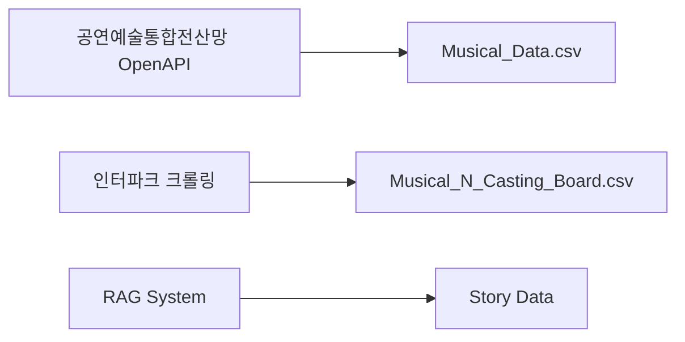
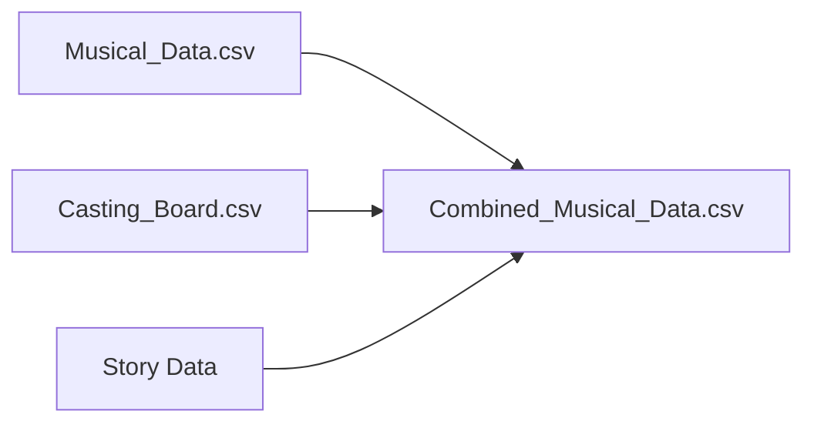
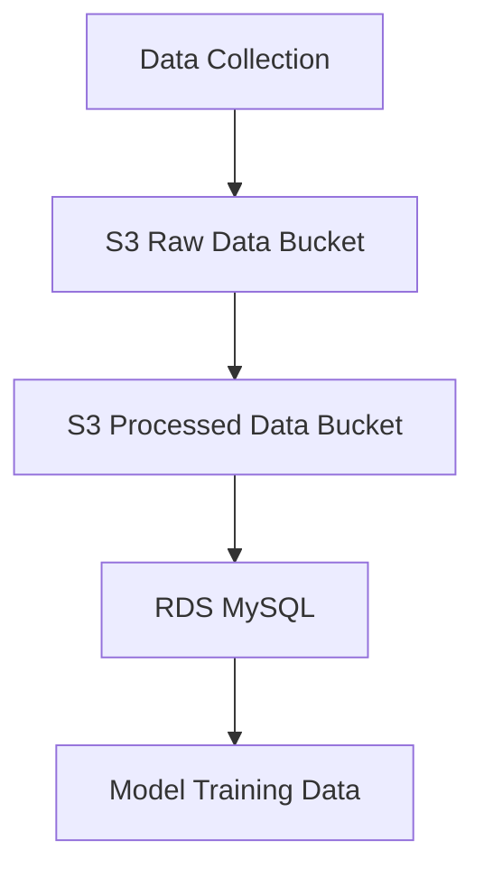
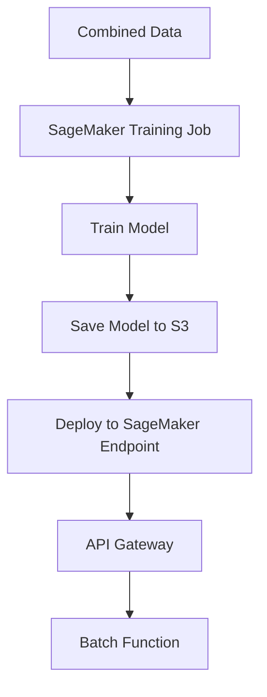
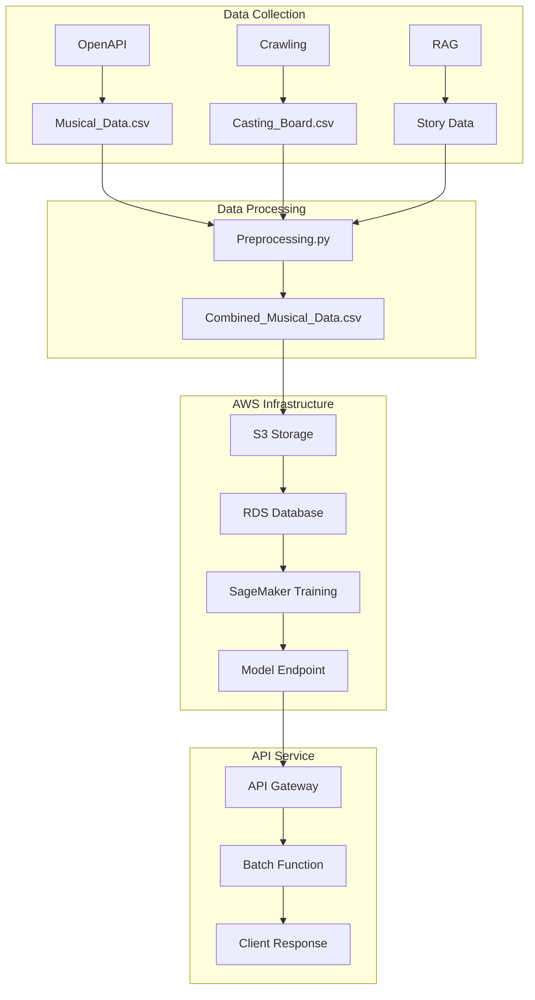

# 뮤지컬 추천 시스템 데이터 파이프라인

## 1. 데이터 수집 단계


## 2. 데이터 전처리 단계
```mermaid
graph TD
    A[Raw Data] --> B[Preprocessing.py]
    B --> |process_musical_data()| C[데이터 병합]
    C --> |날짜와 요일 분리, 출연진 문자열 생성| D[정규화]
    D --> |calculate_daily_booking_rate()| E[일별 예매율 추가]
    E --> |DataFrame 반환 및 CSV 저장| F[Combined_Musical_Data.csv]
```

## 3. 데이터 스키마 통합


### 통합 스키마 구조
```json
{
    "기본 정보": {
        "뮤지컬 제목": "String",
        "관람일": "String(MM/DD)",
        "관람요일": "String",
        "관람 시간": "Time(HH:MM)",
        "줄거리": "Text"
    },
    "공연 정보": {
        "공연 시설명": "String",
        "공연장 최대 수용 수": "Integer",
        "공연 장르": "String"
    },
    "판매 정보": {
        "티켓 가격": "Integer",
        "판매액": "Integer",
        "일별 예매율": "Float",
        "출연진": "String Array"
    }
}
```

## 4. AWS 데이터 저장 구조


### 저장소 구조
- **S3 Raw Data**: `/raw-data/{YYYY-MM}/`
- **S3 Processed**: `/processed-data/{YYYY-MM}/`
- **RDS**: `musical_recommendation_db`

## 5. 모델 훈련 및 배포 파이프라인


## 6. 전체 데이터 파이프라인 흐름도
