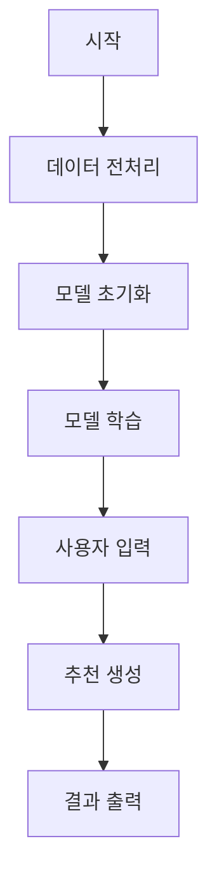

# 뮤지컬 추천 시스템 모델 문서

## 목차
1. [개요](#개요)
2. [파일 구조](#파일-구조)
3. [전체 플로우 차트](#전체-플로우-차트)
4. [상세 기능 설명](#상세-기능-설명)
5. [시간 복잡도 분석](#시간-복잡도-분석)
6. [상세 시스템 다이어그램](#상세-시스템-다이어그램)

## 개요
DeepFM 모델 기반의 뮤지컬 추천 시스템입니다. 
사용자의 선호 배우와 장르를 입력받아 배우 시너지와 장르 선호도를 고려한 최적의 뮤지컬을 추천합니다.

## 파일 구조
```
model/
├── Preprocessing.py        # 데이터 전처리
├── RecommendationModel.py # 추천 시스템 모델
└── recommend_musical.py   # 메인 실행 파일
```

## 전체 플로우 차트


### 데이터 흐름
1. **데이터 전처리 단계**
   - 원본 데이터 검증
   - 데이터 통합 및 정제
   - 예매율 계산
   - 통합 데이터 생성

2. **모델 준비 단계**
   - 데이터 로드
   - 특성 엔지니어링
   - 레이블 인코딩
   - 정규화

3. **모델 학습 단계**
   - DeepFM 모델 구성
   - 학습 데이터 준비
   - 모델 학습 및 평가

### 추천 프로세스
1. **초기화 및 검증**
   - 전처리 데이터 확인
   - 추천 프로세스 시작

2. **사용자 입력 처리**
   - 선호 배우 입력
   - 선호 장르 선택

3. **추천 로직 실행**
   - 배우 분석 (흥행력, 장르 선호도)
   - 시너지 계산
   - 점수 계산 및 가중치 적용

4. **결과 출력**
   - 상위 3개 추천작 선정
   - 상세 정보 출력

## 상세 기능 설명

### 1. Preprocessing.py
#### 주요 함수
- `calculate_daily_booking_rate()`
  - **기능**: 일별 예매율 계산
  - **입/출력**: (판매액, 가격, 수용인원) → 예매율(%)

- `process_musical_data()`
  - **기능**: 데이터 통합 처리
  - **처리**: 캐스팅 통합 → 날짜 분리 → 예매율 계산

### 2. RecommendationModel.py
#### 주요 클래스: MusicalRecommender
- `load_and_preprocess_data()`
  - 데이터 복사 및 전처리
  - 레이블 인코딩
  - 변수 정규화

- `create_deepfm_model()`
  - 임베딩 레이어
  - Deep 네트워크
  - FM 컴포넌트

#### 핵심 분석 함수
```python
def analyze_actor_synergy(actor1, actor2)      
    # 협업 시너지 분석(2명의 배우 → 평균 예매율(float))
def analyze_actor_sales_impact(actor)          
    # 흥행 영향력 분석(배우 → 평균 판매액(float))
def analyze_actor_genre_preference(actor)      
    # 장르 선호도 분석(배우 → 장르별 비율(dict))
def recommend_musicals(favorite_actor, genre)  
    # 최종 추천 생성(배우, 장르 → 상위 3개 추천작)
```

### 3. recommend_musical.py
- **기능**: 사용자 인터페이스
- **핵심**: `get_musical_recommendations()`

## 시간 복잡도 분석
- **데이터 전처리**: O(n * log n)
- **모델 학습**: O(n/b * d)
- **추천 생성**: O(n * m)

## 상세 시스템 다이어그램

### 1. 전체 시스템 아키텍처
```
[원본 데이터] → [전처리] → [모델] → [추천 결과]
```
```
[Musical_Data.csv] [Casting_Board.csv]
         ↓           ↓
      [Preprocessing.py] → Combined_Musical_Data.csv
             ↓
  [RecommendationModel.py] ← [recommend_musical.py]
             ↓
    [추천 결과 출력]
```

### 2. 데이터 처리 파이프라인
```
Raw Data → 전처리 → 특성 엔지니어링 → 모델 학습 → 예측/추천
```

### 3. DeepFM 모델 구조
```
 Input Layer
      ↓
[Embedding Layer] → [FM] ──┐
      ↓                    ├→ [Output Layer]
[Deep] ────────────────────┘
```

### 4. 추천 점수 계산
```
기본 예측 예매율
    ↓
선호 배우 (×1.2) →→→┐
    ↓               │
선호 장르 (×1.1) →→→├→ 최종 점수 (max 100%)
    ↓               │
시너지 (×1.5) ──────┘
```
### 5. 추천 시스템 실행 흐름
```
시작 → 데이터 확인 → 모델 초기화 → 입력 처리 
→ 추천 계산 → 결과 출력
```

### 6. 데이터베이스 스키마

```
Combined_Musical_Data.csv
├── 기본 정보
│   ├── 뮤지컬 제목 (String)
│   ├── 관람일/요일 (Date/String)
│   └── 줄거리 (Text)
├── 공연 정보
│   ├── 공연 시설명 (String)
│   ├── 최대 수용 수 (Integer)
│   └── 공연 장르 (String)
└── 판매 정보
    ├── 티켓 가격 (Integer)
    ├── 판매액 (Integer)
    ├── 일별 예매율 (Float)
    └── 출연진 (String Array)
```
